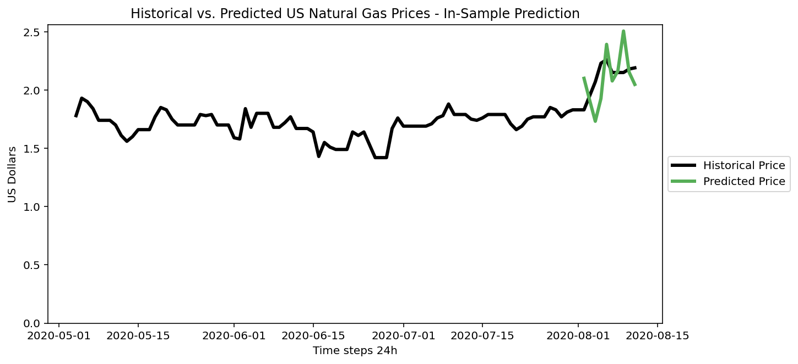
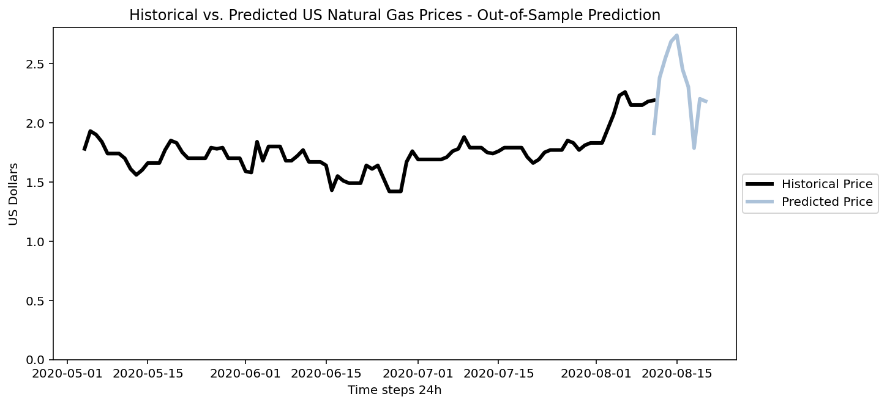

#  Example of Multi-Step, Multivariate Forecasting with an LSTM Encoder-Decoder Network in Keras

In the `Forecasting with LSTM Encoder-Decoder in Keras` notebook a simple encoder-decoder network is applied to a timeseries forecasting problem:  predicting natural gas prices in the US with a forecast horizon of 10 days (horizon may be updated in the notebook by changing time steps "out").  Time steps "in" are also set to 10 days.  This is so that 1) only 10 days are needed to infer the following 10 days 2) a 10-day historical dataset may be used to retrain the network in an online-learning fashion.  Time steps "in" may also be updated in the notebook.  Additional features added in the notebook include:
- Is this a weekend (one-hot encoded)
- Weekday (one-hot encoded)
- Lags (e.g. 7-day or 30-day)

Example "in-sample" forecast (using model trained on entire dataset to show actual vs. prediciton on part of training dataset) of natural gas prices:



Example of "out-of-sample" forecast (using model trained on entire dataset to predict future values according to set forecast horizon - here, 10 days):




To run the sample:

```
pip install -r requirements.txt
jupyter notebook
```

The dataset is [Natural Gas Price Forecasting](https://www.kaggle.com/arbethi/natural-gas-price-forecasting) from Kaggle (CC0 1.0 Universal Public Domain Dedication license) and has the following features:
- Date (from 1997-2020) -  aggregated to 1 day
- Price of natural gas in dollars

The Long Short Term Memory Algorithm (LSTM) multi-step time series forecasting resources upon which this notebook is based may be found here:
- How to scale data: https://machinelearningmastery.com/how-to-scale-data-for-long-short-term-memory-networks-in-python/
- Encoder/decoder LSTM used here: https://machinelearningmastery.com/encoder-decoder-long-short-term-memory-networks/
- Develop LSTM for this scenario (see "Multiple Parallel Input and Multi-Step Output"): https://machinelearningmastery.com/how-to-develop-lstm-models-for-time-series-forecasting/
